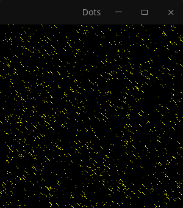
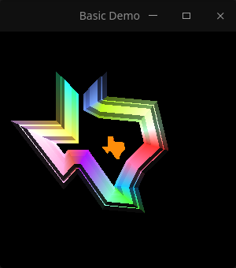
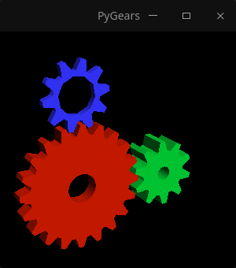
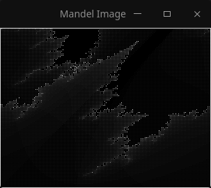
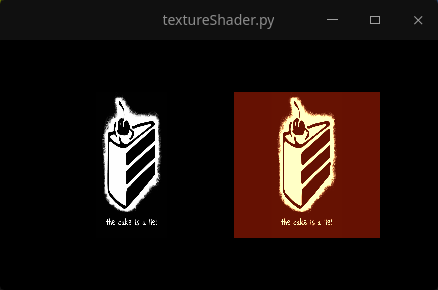
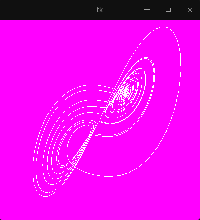
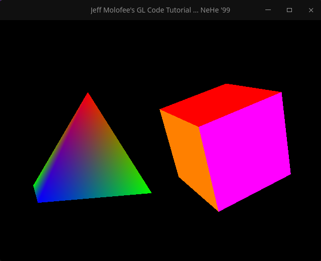
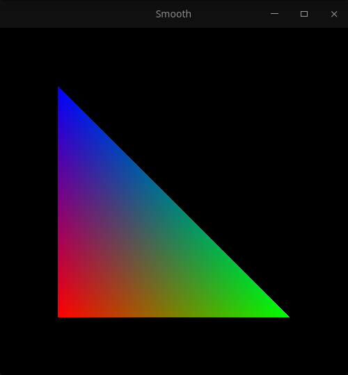

# DemOpenGL

Demonstration of the power of OpenGL in Python3. Inside this directory is exposed
a collection of examples of the PyOpenGL library,

The main contributor to DemOpenGL is PyOpenGL-Demo, due to the fact that the
author of DemOpenGL was looking for examples of PyOpenGL to contribute to his
learning of this library and he found PyOpenGL-Demo which is old, out of date and
mismatched to python3 standards. The author DemOpenGL updated it creating DemOpenGL,
created new examples and added some examples from other authors.

DemOpenGL does not pretend to be a copy, it is a conglomerate of examples that
contribute to people's understanding of the PyOpenGL library, which is a standard binding
of the library written in C called OpenGL.

If you want to contact the author of DemOpenGL send an email to
[ismaelbeli.com@gmail.com](ismaelbeli.com@gmail.com) or you can also contact him
by telegram [@ismaelxyz](t.me/@ismaelxyz).

# Gallery

