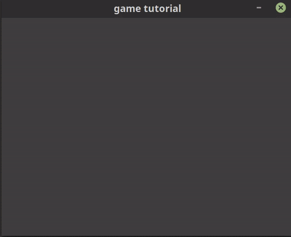

# GDino

I was browsing through the different projects on Github and found [this](https://github.com/sunjay/rust-simple-game-dev-tutorial) unfortunately it was generating a segment violation, but my curiosity led me to remove two of its dependencies (unnecessary in my opinion), slightly modify the architecture and finally bring it to life once again.
 
After finishing "rust-lazy-foo" I may take this seriously and create a tutorial on game development with Rust. 

