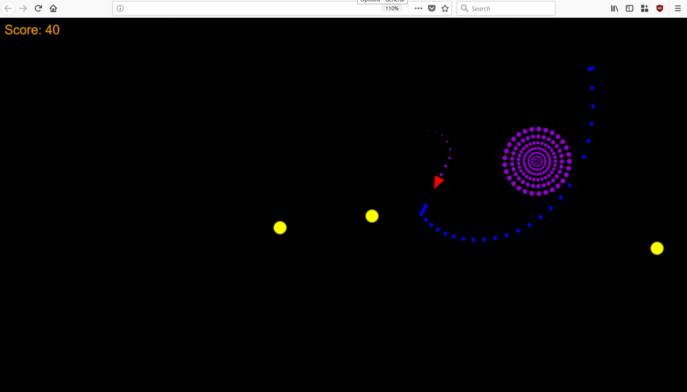

Rocket on WASM
==============

An adapted version of the [Rocket](https://github.com/aochagavia/rocket) game, running on WASM!

[Read the blog post](https://aochagavia.github.io/blog/rocket---a-rust-game-running-on-wasm/)
about the development of this WASM version (includes an embedded canvas where you can play the game).

## Screenshot



## How to play

As you can see in the screenshot, you are the red rocket and have to save the world from
the yellow invaders. To do so, you can use the following controls:

Keyboard                | Action
----------------------- | ------------
<kbd>&uparrow;</kbd>    | Boost
<kbd>&leftarrow;</kbd>  | Rotate left
<kbd>&rightarrow;</kbd> | Rotate right
<kbd>Space</kbd>        | Shoot

## Environment

```bash
rustup target add wasm32-unknown-unknown
cargo install basic-http-server
cargo install wasm-bindgen-cli
```

## Compiling and running

```bash
cargo build --release --target wasm32-unknown-unknown
wasm-bindgen ./target/wasm32-unknown-unknown/release/rocket.wasm --out-dir public/wasm --target web --no-typescript
```

The generated wasm will be copied to the `public` directory.

```bash
basic-http-server public
```

Try opening http://localhost:4000/ on your browser to check whether it works.
